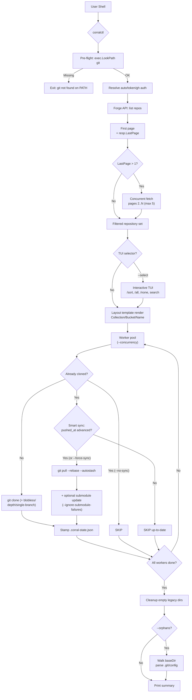

<!-- SPDX-License-Identifier: GPL-3.0-only -->

<p align="center">
  
</p>

<h1 align="center"><a id="corral"></a>corralctl</h1>

<p align="center">
  Automatically clone and organise repositories from GitHub, GitLab, Gitea, Forgejo, Codeberg and Bitbucket using Finder-friendly collections, ecosystems, and metadata.
</p>

<p align="center">
  <a href="https://github.com/sebastienrousseau/corralctl/actions"></a>
  <a href="https://pkg.go.dev/github.com/sebastienrousseau/corralctl"></a>
  <a href="https://golangci-lint.run/"></a>
  <a href="https://codecov.io/gh/sebastienrousseau/corralctl"></a>
  <a href="https://scorecard.dev/viewer/?uri=github.com/sebastienrousseau/corralctl"></a>
  <a href="https://www.bestpractices.dev/projects/13455"></a>
  <a href="https://doc.corrallib.com"></a>
  <a href="https://github.com/sebastienrousseau/corralctl/releases/latest"></a>
  <a href="LICENSE"></a>
</p>

<p align="center">
  
</p>

---

## Contents

**Getting started**

- [Install](#install) — mise, Homebrew, Arch, Nix, Go, or from source
- [Quick Start](#quick-start) — clone and organise in one command

**Features & Capabilities**

- [Features](#features) — structured layout, concurrency, and security
- [Architecture](#architecture) — end-to-end flow from API fetch to per-repo dispatch
- [Interactive TUI Mode](#interactive-tui-mode) — keybindings, commands, and autocomplete
- [Layout Customization](#layout-customization) — Apple-style collections, ecosystems, and custom templates
- [Smart Syncing](#smart-syncing) — network-optimised incremental updates
- [Exec Mode](#exec-mode) — concurrent batch execution of Git commands
- [Mirror to other forges](#mirror-to-other-forges) — `corralctl sync` pushes the tree to GitLab, Gitea, Forgejo, Codeberg, Bitbucket or GitHub
- [MCP Server](#mcp-server-for-ai-agents) — expose your local workspace to AI coding agents
- [Cross-repository symbol lookup](#cross-repository-symbol-lookup) — find where anything is defined, across every clone

**Reference & Operational**

- [Usage & Flags](#usage--flags) — complete CLI parameter reference
- [Examples](#examples) — index of runnable programmatic examples
- [Troubleshooting](#troubleshooting) — quick solutions to common errors
- [Frequently Asked Questions](#frequently-asked-questions) — design decisions and Windows/WSL support

**Project**

- [Documentation](#documentation) — manual, API reference, developer docs
- [When not to use corralctl](#when-not-to-use-corralctl) — honest limits
- [Requirements & toolchain policy](#requirements--toolchain-policy) — the Go floor and when it moves
- [Stability guarantees](#stability-guarantees) — what a breaking change means here
- [Security & hardening](#security--hardening) — reporting, posture, fuzzing
- [License](#license)

---

## Install

### mise (macOS / Linux)

```bash
mise use -g github:sebastienrousseau/corralctl
```

This installs the latest released `corralctl` binary and keeps it managed with
the rest of your mise tools.

### Homebrew (macOS)

```bash
brew install sebastienrousseau/tap/corralctl
```

Homebrew here is a cask, which is a macOS-only mechanism — `brew install` on
Linux will refuse it. On Linux use the `.deb`/`.rpm` packages or the tarballs
attached to each [release](https://github.com/sebastienrousseau/corralctl/releases/latest),
or install with [mise](#mise-macos--linux) or the
[Go toolchain](#go-toolchain).

### Arch Linux (AUR)

```bash
yay -S corralctl-bin    # or: paru -S corralctl-bin
```

### Nix (any platform)

```sh
nix run github:sebastienrousseau/corralctl -- --help   # run without installing
nix profile install github:sebastienrousseau/corralctl # install
```

The flake ships the binary with its manpages and shell completions, and
`nix develop` gives a shell with every tool the project's CI gates need,
pinned by `flake.lock`.

### Go toolchain

```bash
go install github.com/sebastienrousseau/corralctl/cmd/corralctl@latest
```

Installs into `$(go env GOPATH)/bin` (or `$GOBIN` when set). Note that a
binary built this way reports `corralctl version dev`: the real version is
stamped by the release pipeline through `-ldflags`, which `go install` does
not apply. Use a release artefact if you need `--version` to be meaningful.

### Build from source

Requires Go 1.26+ and Git:

```bash
git clone https://github.com/sebastienrousseau/corralctl.git
cd corral
make install            # installs ~/.local/bin/corralctl
```

### Platform Prerequisites

<details>
<summary><b>macOS</b></summary>

```bash
brew install go git gh
```

</details>

<details>
<summary><b>Ubuntu / Debian / WSL2</b></summary>

```bash
sudo apt install golang git
```

Install `gh` separately following the [GitHub CLI installation guide](https://github.com/cli/cli/blob/trunk/docs/install_linux.md).
</details>

<details>
<summary><b>Fedora / RHEL</b></summary>

```bash
sudo dnf install golang git gh
```

</details>

---

## Quick Start

Run `corralctl clone` with an owner name (GitHub username or organization) to clone and automatically sort all repositories into a clean local directory hierarchy:

```bash
# Log in to GitHub CLI first (or set GITHUB_TOKEN)
gh auth login

# Clone and organise every repository for your profile
corralctl clone my-username
```

The bare form, `corralctl my-username`, does the same thing. One binary,
one base command, and every operation is a subcommand of it:

| Command | Does |
| :--- | :--- |
| `corralctl clone <owner>` | Clone what is missing, pull what is stale, into the organised layout |
| `corralctl sync --to <forge>` | Mirror the organised tree out to another forge — see [Mirror to other forges](#mirror-to-other-forges) |
| `corralctl status` | Inventory local clones and their state |
| `corralctl plan <owner>` | Preview a reconciliation without touching disk |
| `corralctl prune <owner>` | Remove clones no longer upstream, refusing any with unpublished work |
| `corralctl exec <cmd>` | Run a command across every clone — see [Exec Mode](#exec-mode) |
| `corralctl mcp` | Serve the workspace to AI agents — see [MCP Server](#mcp-server-for-ai-agents) |

This converges your local directory structure into a structured mirror:

```text
~/Code/
├── Public/
│   ├── Go/
│   │   └── corral/
│   ├── Rust/
│   │   └── my-crate/
│   └── Web/
│       └── project.github.io/
├── Private/
│   └── Python/
│       └── internal-tool/
├── Forks/
│   └── Rust/
│       └── upstream-project/
└── Work/
```

On macOS, corralctl also writes native Finder Tags to repository folders while
preserving tags you added yourself. This keeps the physical hierarchy shallow
and makes Finder searches and Smart Folders useful across ecosystems.

---

## Features

| Feature | Description |
| :--- | :--- |
| **Apple-style Layout** | Sorts source repositories into `Public/`, `Private/`, and `Forks/`, using Finder-friendly ecosystem names such as `Go`, `Rust`, `Python`, and `Web`. |
| **Finder Tags** | Applies native macOS lifecycle colors and searchable visibility, ecosystem, owner, fork, archive, template, and mirror metadata without replacing personal tags. |
| **Smart Syncing** | Compares remote `pushed_at` metadata to skip redundant network calls, speeding up syncs by 10x-50x. |
| **Interactive Selection** | A fully featured Terminal UI (TUI) selector dashboard to search, preview, and select repositories to clone. |
| **Legacy Migration** | Automatically moves existing flat directory layouts into the new structure and cleans up empty folders. |
| **Concurrency** | Processes clones and pulls concurrently with configurable worker limits (`--concurrency`). |
| **Batch Commands** | Batch execute Git commands concurrently across all cloned repositories using `exec`. |
| **Zero Configuration** | No configuration files required — simple, sensible defaults that work out of the box. |

---

## Architecture

A single run resolves git, fetches every repository concurrently from the forge (GitHub, GitLab, Gitea, Forgejo, Codeberg or Bitbucket), optionally lets you pick a subset interactively, then dispatches clone / smart-sync / skip decisions across a worker pool. Smart sync consults a per-repository `.corral-state.json` sidecar to skip a `git pull` when the upstream `pushed_at` is unchanged.



---

## Interactive TUI Mode

By passing the `-i` or `--interactive` flag, you can launch the selection dashboard:

```bash
./corralctl -i my-username
```

### Keybindings

- `[space]` — Toggle selection of the current repository.
- `[ctrl+a]` — Select all currently filtered repositories.
- `[ctrl+n]` — Deselect all currently filtered repositories.
- `[/]` — Enter command / filter mode.
- `[enter]` — Confirm selection and begin cloning/syncing.
- `[esc]` — Exit the application silently.

### In-Session Commands

Press `/` inside the TUI to enter Command Mode. Commands support prefix-based autocompletion (press `[tab]` or `[right-arrow]` to autocomplete):

- `/sort <field>` — Sort repositories. Fields:
  - `name` — Alphabetical sort by repository name.
  - `language` / `lang` — Alphabetical sort by language.
  - `visibility` / `vis` — Alphabetical sort by visibility (Private/Public).
  - `public` — Prioritize public repositories at the top.
  - `private` — Prioritize private repositories at the top.
- `/all` — Select all filtered repositories.
- `/none` — Deselect all filtered repositories.
- `/exit` / `/quit` — Cancel and exit silently.
- `/help` — Display the in-session help panel overlay.

---

## Layout Customization

By default, corralctl uses the Apple-style layout `{{.Collection}}/{{.Bucket}}/{{.Name}}`. Forks use the `Forks` collection, while `.github.io` repositories use the `Web` bucket regardless of their detected language. You can override this using the `--layout` flag:

```bash
./corralctl --layout "{{.Owner}}/{{.Name}}" my-org
```

Supported placeholders:

- `{{.Owner}}` — GitHub owner name.
- `{{.Name}}` — Repository name.
- `{{.Collection}}` — Canonical root (`Public`, `Private`, or `Forks`).
- `{{.Bucket}}` — Finder-facing ecosystem bucket (`Go`, `Rust`, `Web`, etc.).
- `{{.Language}}` — Primary language normalized to lowercase.
- `{{.Visibility}}` — Repository visibility normalized to lowercase.

### Finder Tags on macOS

Finder tagging is enabled by default on macOS and can be disabled with
`--finder-tags=false`. corralctl manages the following lifecycle taxonomy:

| Color | Tag | Automatic signal |
| :--- | :--- | :--- |
| Green | `Active` | Pushed within seven days or checked out on a non-default branch |
| Yellow | `On Hold` | Archived on GitHub |
| Red | `Needs Fix` | corralctl encountered a sync failure for the matching clone |
| Purple | `Experiment` | Fork, template, or mirror repository |

Uncolored metadata tags include `Visibility: Public`, `Collection: Forks`,
`Ecosystem: Rust`, `Owner: example`, `GitHub`, `Fork`, `Archived`, `Template`, and `Mirror`.
Finder can combine these tags in searches or saved Smart Folders.

---

## Smart Syncing

corralctl stores synchronization metadata next to each repository's `.git/` folder inside a `.corral-state.json` sidecar file:

- **No Redundant Pulls:** If the remote repository has not received new pushes since the last sync, `git pull` is skipped completely.
- **Overrides:** To bypass smart checks and force corralctl to perform a full `git pull`, pass the `--force-sync` flag.
- **Skip Syncing entirely:** Pass `--no-sync` to skip updates on all cloned repositories.

---

## Exec Mode

Execute arbitrary shell commands concurrently across your organized repositories:

```bash
# Check git status for all Go/Rust private repositories
./corralctl exec "git status -s" --languages go,rust --visibility private
```

---

## Mirror to other forges

`corralctl sync` is the outbound half of the workflow: what `clone` pulls in
from one forge, `sync` pushes out to others, so the organised tree becomes
the source of truth for a mirror on every host you care about.

```bash
export GITLAB_TOKEN=glpat-…            # scope: api
export GITEA_TOKEN=…                   # scope: write:repository

corralctl sync --to gitlab --to gitea@https://git.example.com --dry-run
corralctl sync --to gitlab --to gitea@https://git.example.com
```

For every repository under the base directory, on every destination, `sync`
creates the destination repository if it does not exist — with the
visibility the local layout says, `Public/` or `Private/` — points a remote
named after the forge at it, and pushes in one round trip:

```text
git push --prune --no-verify <forge> refs/heads/*:refs/heads/* +refs/tags/*:refs/tags/*
```

Every local branch and tag exists on the destination afterwards, and nothing
else does. Branches are never forced: a destination that has moved on is
refused and reported, not overwritten. Tags follow the local namespace.

A destination is `<forge>[:<owner>][@<url>]`:

| `--to` | Mirrors to |
| :--- | :--- |
| `gitlab` | gitlab.com, under the token's own account |
| `gitlab:my-group` | gitlab.com, under a group |
| `github:my-org` | github.com, under an organisation |
| `codeberg` · `bitbucket:workspace` | the public instance |
| `gitea@https://git.example.com` | a self-hosted Gitea or Forgejo |

Credentials are the same environment variables `clone` uses to list from a
forge: `GITHUB_TOKEN` (or the `gh` CLI), `GITLAB_TOKEN`, `BITBUCKET_TOKEN`,
and `GITEA_TOKEN`, `FORGEJO_TOKEN` or `CODEBERG_TOKEN` for the Gitea family,
each also accepted with a `CORRAL_` prefix. Over HTTPS, the default, the same
token authenticates the push, scoped to that forge's origin and never written
to `.git/config`; `--protocol ssh` uses your keys instead.

Two refusals are built in. A repository is never pushed to the forge its
`origin` lives on — corral clones from six forges, so the tree can hold a
clone whose origin *is* a destination, and pruning against your own upstream
is not a mirror. And a destination that already holds a same-named
repository with the other visibility is an error, never a silent reuse.

Results go to stdout in `--output text`, `json` or `ndjson`; the exit code is
non-zero if any repository failed, so a cron job can alert on it. This
replaces the standalone `corral-sync` tool, whose `gitlab` and `gitea` remote
names are kept so existing clones carry over unchanged.

---

## MCP Server (for AI agents)

corralctl ships a Model Context Protocol server that exposes your local, corralctl-organised workspace to AI coding agents — Claude Code, Cursor, Cline, Codex CLI, Aider, and anything else that speaks MCP. **In its default read-only mode no network calls are made and the GitHub API is never contacted**; the server is a window into the clones already on disk. (`--enable-mutations` adds `corral_clone_repo` and `corral_sync_repo`, which do reach the network — they shell out to `git`. The GitHub API is still never contacted.)

Where GitHub's own MCP server covers the remote API surface (issues, PRs, search), `corral-mcp` covers the dimension only it can — your *local mirror*, organised by visibility and language, queryable without a round-trip.

## Tools

- `corral_list_repos` — Filter local clones by visibility / language / name / sync state
- `corral_find_repo` — Resolve a fuzzy name to one clone (returns candidates on ambiguity)
- `corral_get_repo_metadata` — Full metadata for one clone, including current branch
- `corral_status_summary` — Workspace summary: counts by visibility and language
- `corral_workspace_index` — Full structured index in a single call
- `corral_find_symbol` — Where a symbol is declared, across *every* clone
- `corral_search_code` — Where text appears, across *every* clone
- `corral_repo_overview` — One repository's shape in a single call

**Write tools (v0.0.12, opt-in via `--enable-mutations`):**

- `corral_sync_repo` — Runs `git pull --rebase --autostash` against one clone
- `corral_clone_repo` — Clones a URL into a sandboxed target path
- `corral_delete_repo` — Removes a clone. Requires `--enable-destructive-mutations`. Refuses on uncommitted/unpushed changes, and asks a person to approve each deletion

Every mutation writes a JSONL audit record to
`$XDG_STATE_HOME/corral/mutations.log` (or `~/.local/state/corral/mutations.log`),
capturing tool, target, args, result and timestamp. Two records per mutation: a
durable *intent* before anything happens, and a *completion* linked by operation
ID. A mutation whose intent cannot be recorded does not run.

Override the location with `--audit-log <path>`. The file rotates at 8 MiB and
keeps three previous generations (`mutations.log.1` … `.3`), so a long-running
server cannot fill the disk.

### Prompts (v0.0.12)

- `explain_workspace` — Ask the agent to survey the workspace via read-only tools and summarise it
- `identify_stale_repos` — Ask the agent to find clones whose `.corral-state.json` says they haven't been synced recently (default: 30 days)

### Resources

- `corral://workspace/index`
- `corral://repo/{owner}/{name}/state`
- `corral://repo/{owner}/{name}/tree`
- `corral://repo/{owner}/{name}/file/{path}` (bounded at 1 MiB; path-traversal protected)

### Install

**Claude Code:**

```bash
claude mcp add corral -- corralctl mcp
```

**Cursor / Cline** (`mcp.json`):

```json
{
  "mcpServers": {
    "corral": {
      "command": "corralctl",
      "args": ["mcp"]
    }
  }
}
```

**Docker (no local install required)** — the same binary the MCP Registry advertises, mounted against your workspace:

```json
{
  "mcpServers": {
    "corral": {
      "command": "docker",
      "args": [
        "run", "--rm", "-i",
        "--user", "1000:1000",
        "-v", "${HOME}/Code:/workspace:ro",
        "ghcr.io/sebastienrousseau/corralctl:latest",
        "mcp", "--root", "/workspace"
      ]
    }
  }
}
```

Notes on the args:

- **`--user 1000:1000`** — replace with your host UID:GID (`id -u`:`id -g`) so the containerised scanner reads the mounted workspace with the same permissions your host user has. Without this the image runs as a system UID inside the container and hits `permission denied` on any directory your workspace makes group- or user-private.
- **`-v … :ro`** — read-only mount. The v0 tools are read-only anyway; mounting `:ro` documents that and defends against a hostile agent asking the server for a write it doesn't have.
- **`--root /workspace`** — sandbox root inside the container. Every tool and resource path check is scoped to this prefix; requests outside it are rejected regardless of what the agent asks for.

**Sandbox a different root** (defaults to `--base-dir`, then `$HOME/Code`):

```bash
corralctl mcp --root /custom/workspace
```

**Serve over HTTP** instead of stdio, for a client that connects to a running
server rather than launching one:

```bash
corralctl mcp --http 127.0.0.1:7777
```

The address must be on loopback. `--http :7777` binds every interface and is
refused, because this server has no authentication; pass `--allow-remote` if
you have put your own in front of it.

### Safety

- **Read-only by default.** `--enable-mutations` unlocks clone and sync. Deletion additionally requires `--enable-destructive-mutations`; every mutation writes intent and completion records to the audit log.
- **Deletion fails closed.** MCP and CLI pruning refuse repositories with
  working-tree changes; commits on any local branch not reachable from a remote;
  stashes; local-only or divergent tags; **gitignored content** (`.env` files,
  local databases, caches — the least recoverable thing in a clone, and
  invisible to a plain `git status`); **submodules holding unpublished
  commits**; a target that is not a git repository at all; or any state Git
  cannot verify. Each refusal names its specific reason and is written to the
  audit log.
- **Path-traversal protected.** File-resource lookups canonicalise the selected repository root and candidate path, blocking `..` and symlink escapes into sibling repositories or outside the workspace.
- **Per-call approval for deletion.** With `--enable-destructive-mutations`,
  each individual deletion is put to a person over MCP elicitation before it
  runs. The refusal cascade above stops *mistakes*; this is what stops a
  persuaded agent choosing the one clone that passes every check, which no
  amount of prompt text can. Pass `--no-confirm-deletes` only for an
  unattended workspace you are willing to lose.
- **stdio by default; loopback when not.** Without `--http` the server has no
  endpoint and no listening port, and only ever speaks to the parent process
  that launched it. `--http` serves the Streamable HTTP transport, and
  because the server has no authentication and exposes every repository under
  its root, a non-loopback address is refused unless you also pass
  `--allow-remote` — the accidental `--http :7777`, which binds every
  interface, does not start.

---

## Forges

Cloning works against six hosting services:

```bash
corralctl <owner>                                    # GitHub (default)
corralctl <group> --forge gitlab                     # GitLab
corralctl <owner> --forge codeberg                   # Codeberg
corralctl <owner> --forge gitea --forge-url https://git.example.com
corralctl <owner> --forge forgejo --forge-url https://forgejo.example.com
corralctl <workspace> --forge bitbucket                # Bitbucket Cloud
```

Gitea and Forgejo have no single public instance, so they need
`--forge-url`. GitLab and Codeberg default to theirs. `--forge-url` alone
is enough when the host is recognisable — `--forge-url
https://codeberg.org` implies Codeberg.

Credentials come from the environment, under the names each forge's own
tooling already uses: `GITLAB_TOKEN` (or `CI_JOB_TOKEN`), and
`GITEA_TOKEN` / `FORGEJO_TOKEN` / `CODEBERG_TOKEN`, and
`BITBUCKET_TOKEN`. A corral-specific
`CORRAL_GITLAB_TOKEN` or `CORRAL_FORGE_TOKEN` wins where both are set.
GitHub keeps its existing ladder — explicit token, then the environment,
then the `gh` CLI.

`--forge` applies to everything that talks to a hosting service:
`corralctl <owner>`, `plan`, `profile` and `prune`. Orphan detection and
`prune` compare against the forge you listed from, and scope by host — a
GitLab clone under the same owner name is never a GitHub orphan.

A profile can pin its own forge, so one config can cover owners on
several services:

```json
{
  "profiles": {
    "work":     { "owners": ["acme"],   "settings": { "forge": "gitlab" } },
    "personal": { "owners": ["me"] },
    "upstream": { "owners": ["forgejo"], "settings": { "forge": "codeberg" } }
  }
}
```

**Reading was never host-specific.** The index, the MCP server, symbol
lookup and content search work on clones, so a repository you cloned by
hand from anywhere has always been a first-class citizen.

---

## Coming from another tool

Migration guides live in [`docs/migrating/`](docs/migrating/README.md):
from [ghq](docs/migrating/from-ghq.md), from
[a hand-written clone script](docs/migrating/from-a-script.md), from
[a single-repository code index](docs/migrating/from-a-code-index.md),
or from [an unsorted `~/src`](docs/migrating/from-an-unsorted-directory.md).

Each says what carries over, what is genuinely different, and what
corral will not do — nothing there requires re-cloning, and `corralctl
plan` shows you the outcome before anything changes.

---

## Cross-repository symbol lookup

Every code-context server can tell an agent where a symbol is defined **in
the repository it has open**. corralctl is the only one that can answer across
**every clone on the machine**, because it is the only one that knows they
are all there.

```jsonc
// corral_find_symbol { "name": "CanonicalRemote" }
{
  "query": "CanonicalRemote",
  "repositories_search": 2,
  "total_matched": 1,
  "symbols": [
    {
      "repo": "Public/go/corral",
      "symbol": "CanonicalRemote",
      "kind": "func",
      "file": "internal/git/git.go",
      "line": 266,
      "exported": true,
      "language": "go"
    }
  ]
}
```

Filter by `kind` (func, method, type, interface, const, var), scope to one
`repo`, match by `substring`, or restrict to the `exported_only` surface.
Methods are found by their bare name or as `Receiver.Name`. Test
declarations are excluded by default — on a well-tested repository they
outnumber everything else — and `include_tests` brings them back.

`corral_repo_overview` summarises one repository in a single call: its
origin, file count, declaration counts by kind, and its most significant
exported types and functions. Reach for it before reading files.

`corral_search_code` is the counterpart to `corral_find_symbol`: find_symbol
answers where something is *declared*, search_code answers where it is
*written* — call sites, configuration keys, the error string from a ticket.
Literal by default, `regex` for RE2, and narrowable by `repo`, `language` or
`path_glob`.

It searches only the files the file resource would serve, so a credential
file can never match — otherwise search would be a way to read a refused
file one line at a time. Test files are excluded unless `include_tests` is
set, and the response says plainly when a bound was reached rather than
presenting a partial answer as complete.

**Indexed languages: Go, Python, TypeScript, JavaScript, Rust.**

Go is parsed with `go/ast` — the compiler's own parser, so the index agrees
with the language by construction. The rest are read by a line scanner, in
the tradition of ctags: it recognises declaration syntax rather than
building a syntax tree, because every mature parser for those languages is
either CGO (tree-sitter), a port that lags the language, or larger than
corral itself. ADR-0006 records why CGO is not available here.

The scanner runs over source that has had comment and string *contents*
blanked out, so a `class` inside a docstring or a `function` inside a
template literal is invisible to it.

Extracted symbols are cached under `$XDG_CACHE_HOME/corral/symbols` so the
first lookup of a session is not the slow one. A cache hit still walks the
repository — the walk is what produces the fingerprint the entry is keyed
on — so an edited clone is never served stale. `--symbol-cache off`
disables it; `--symbol-cache <dir>` moves it.

On a real 187-repository workspace a cross-repository lookup went from
**6.9 s to 1.3 s**: most of that from searching repositories concurrently
rather than one after another, the rest from the cache. What it cannot do is resolve types,
see through macros, or follow a declaration split across lines unusually —
and it is wrong cheaply: a missed symbol falls back to reading files, and a
spurious one is a wrong line in the right file. What it will not do is
invent a symbol that does not exist.

---

## Usage & Flags

### Positional Arguments

```bash
corralctl <owner> [base_dir] [limit]
```

- `<owner>` — GitHub username or organization (Required).
- `[base_dir]` — Root directory to save repositories (Default: `$HOME/Code`).
- `[limit]` — Maximum repositories to fetch (Default: `1000`).

### Command Options

| Option | Short | Default | Description |
| :--- | :--- | :--- | :--- |
| `--base-dir` | — | `$HOME/Code` | Root directory for cloned repos |
| `--limit` | `-l` | `1000` | Maximum repositories to fetch |
| `--concurrency` | `-c` | `1` | Number of concurrent worker threads |
| `--dry-run` | `-n` | off | Preview actions without making changes |
| `--orphans` | `-o` | off | Detect local repositories no longer on GitHub |
| `--protocol` | `-p` | `https` | Protocol to clone: `ssh` or `https` |
| `--no-sync` | — | off | Skip pulling latest changes for existing clones |
| `--force-sync` | — | off | Force git pull regardless of cached state |
| `--layout` | — | `...` | Templated path layout for repositories |
| `--finder-tags` | — | on (macOS) | Apply managed native Finder Tags to repository folders |
| `--interactive` | `-i` | off | Launch the interactive selector TUI dashboard |
| `--recurse-submodules`| — | off | Initialise submodules on clone and sync |
| `--output` | — | `text` | Output format: `text`, `json`, or `ndjson` |
| `--auth` | — | `auto` | Auth mode: `auto`, `token`, or `gh` |
| `--visibility` | — | `all` | Filter by visibility: `all`, `public`, `private` |
| `--include-forks` | — | on | Include forked repositories under `Forks/` |
| `--include-archived` | — | on | Include archived repositories and tag them `On Hold` |
| `--languages` | — | — | Comma-separated language filter (e.g. `go,rust`) |
| `--exclude-languages`| — | — | Comma-separated language exclude list |
| `--clone-depth` | — | `0` | Shallow clone depth (`0` disables shallow clone) |
| `--api-request-timeout` | — | `30s` | Deadline for a single GitHub API request |
| `--api-total-timeout` | — | `10m` | Deadline for the whole paginated fetch, including retries and backoff |
| `--api-timeout` | — | — | **Deprecated.** Was applied to both of the above at once, capping a whole listing at 30s. Sets both when given; warns on stderr |
| `--log-level` | — | `info` | Diagnostic verbosity on stderr: `error`, `warn`, `info`, `debug` |

### Diagnostics

Results go to stdout in the format `--output` selects. Diagnostics — what was
skipped, what was worked around, why — go to stderr, so `--output json` stays
pipeable no matter how noisy the run is.

`--log-level` controls how much of that stderr you get. `CORRAL_LOG_LEVEL`
sets the same thing for a whole shell session.

```bash
# Why did that repository not migrate? Turn the detail up.
corralctl sebastienrousseau --log-level debug

# Machine-readable results, quiet stderr, both at once.
corralctl sebastienrousseau --output json --log-level error > repos.json

# For a bug report: full detail, everything captured.
CORRAL_LOG_LEVEL=debug corralctl sebastienrousseau > out.json 2> diagnostics.log
```

The default, `info`, is what corral has always printed.

### Sync Options

`corralctl sync [base_dir]` takes the persistent `--base-dir`, `--dry-run`
and `--log-level` flags, plus:

| Option | Short | Default | Description |
| :--- | :--- | :--- | :--- |
| `--to` | — | — | Destination as `<forge>[:<owner>][@<url>]`; repeatable, at least one required |
| `--protocol` | `-p` | `https` | Push transport: `https` (the token authenticates) or `ssh` (your keys do) |
| `--concurrency` | `-c` | 4–8 | Repositories mirrored at once, sized from the host |
| `--timeout` | — | `5m` | Deadline for one repository on one destination |
| `--output` | — | `text` | Output format: `text`, `json`, or `ndjson` |
| `--auth` | — | `auto` | GitHub authentication mode: `auto`, `token`, or `gh` |
| `--api-request-timeout` | — | `30s` | Deadline for a single forge API request |

### Operational Commands

```bash
corralctl status --base-dir ~/Code
corralctl plan sebastienrousseau --base-dir ~/Code
corralctl prune sebastienrousseau --base-dir ~/Code --dry-run
corralctl prune sebastienrousseau --base-dir ~/Code --yes
```

`status` inventories local clones, `plan` emits a non-mutating reconciliation,
and `prune` removes only upstream-orphaned clones that pass the unpublished-work
checks. JSON output is available on each command.

Multi-owner profiles use a strict JSON config (default
`~/.config/corral/config.json`) and run with `corralctl profile <name>`:

```json
{
  "profiles": {
    "work": {
      "owners": ["org-one", "org-two"],
      "base_dir": "/home/me/Code",
      "layout": "{{.Owner}}/{{.Visibility}}/{{.Language}}/{{.Name}}",
      "concurrency": 4
    }
  }
}
```

---

## Examples

To inspect the package layout and programmatically run corralctl modules, see the self-contained, copy-pasteable Go code examples in the [examples](examples/) directory:

1. **[Interactive Selector](examples/interactive_selection.go)** — Programmatically configure and launch the selection checklist TUI in AltScreen mode.
2. **[GitHub Repository Fetcher](examples/github_fetch.go)** — Query the GitHub REST API using `github.FetchReposWithOptions` with stars sorting and language constraints.
3. **[Git Syncing](examples/git_clone.go)** — Call the `git` helper package to perform clones, query branches, and resolve origin URLs.
4. **[Engine Orchestrator](examples/engine_run.go)** — Integrate the core engine `engine.Run` to run repository syncing with custom filters, layout structures, and dry-run pre-flights.

---

## Troubleshooting

| Error Message | Cause | Solution |
| :--- | :--- | :--- |
| `ERROR: git not found on PATH` | Git is not installed or missing from the current PATH environment. | Install git via your package manager. |
| `ERROR: GITHUB_TOKEN environment variable not set` | `--auth token` was specified but no environment variable is present. | Run `export GITHUB_TOKEN=$(gh auth token)` or switch to `--auth auto`. |
| `FAILED: owner/repo` | Authentication error or network failure during clone/pull. | Check connectivity and confirm `gh auth status` displays a valid session. |

---

## Frequently Asked Questions

- **Does it work with GitLab or other hosts?**  
  No. corralctl is specifically built to integrate with the GitHub API and GitHub CLI (`gh`).
- **What happens to repositories deleted on GitHub?**  
  Normal reconciliation never deletes them. `--orphans` reports them; the explicit `prune` command can remove verified-safe orphans after `--yes` confirmation.
- **Can I run it inside Cron or systemd timers?**  
  Yes. The command runs non-interactively by default. All Git command credential prompts are bypassed to ensure automated jobs never hang.
- **How are repositories with no primary language stored?**  
  They default to the `Other/` ecosystem category (e.g. `Public/Other/my-repo`).

---

**THE ARCHITECT** ᛫ [Sebastien Rousseau](https://sebastienrousseau.com)  
**THE ENGINE** ᛞ [EUXIS](https://euxis.co) ᛫ Enterprise Unified Execution Intelligence System

---

## Documentation

| Resource | Where |
|---|---|
| **User manual** | <https://doc.corrallib.com> |
| **API reference** | <https://pkg.go.dev/github.com/sebastienrousseau/corralctl> |
| **Developer docs** | [DEVELOPMENT.md](DEVELOPMENT.md) — toolchain and every CI gate reproduced locally |
| **Architecture** | [docs/ARCHITECTURE.md](docs/ARCHITECTURE.md) |
| **Decision records** | [docs/adr/](docs/adr/) |
| **Security model** | [docs/security-model.md](docs/security-model.md) |
| **Packaging** | [docs/packaging.md](docs/packaging.md) — for distribution maintainers |
| **Support** | [SUPPORT.md](SUPPORT.md) |

Once installed, `man corralctl` works offline, and every subcommand has its
own page (`man corralctl-mcp`).

---

## When not to use corralctl

corralctl is opinionated, and the opinions do not suit everyone.

- **You want a full mirror or backup.** corralctl clones working copies to be
  read and edited. For archival mirroring use `git clone --mirror` or a
  purpose-built tool; corralctl will not preserve every ref or hold a
  guaranteed-complete copy.
- **You need a forge corral does not list from.** GitHub, GitLab, Gitea,
  Forgejo, Codeberg and Bitbucket are supported; anything else is not.
  Reading is forge-neutral — a clone from any host is a first-class citizen
  in the index, the MCP server and symbol lookup — but `corralctl <owner>`
  only knows those six.
- **Your repositories must stay where they are.** corralctl's value is a
  consistent layout, and the default reorganises clones into
  `Collection/Bucket/Name`. If a fixed path matters, use `--layout` to
  match your existing tree — or a different tool.
- **You want code intelligence.** The MCP server does index symbols and
  search file contents across every clone, but shallowly: a declaration
  is a name, a kind, a file and a line. It does not resolve types, find
  references, or rename — an LSP does those, one project at a time, and
  corral is the layer that tells an agent which project to open.
- **You need Windows without WSL.** Binaries are published for Windows, but
  macOS Finder tags are a no-op there and the experience is less tested
  than on macOS and Linux.

---

## Requirements & toolchain policy

| | |
|---|---|
| **Go** | The `go` directive in [`go.mod`](go.mod) — currently **1.26.6** |
| **git** | 2.30 or newer, on `PATH` |
| **gh** | Optional; only for `--auth gh` |

The Go floor is stated in exactly one place, `go.mod`, and CI sets
`GOTOOLCHAIN=auto` so it cannot disagree with a workflow input.

**Policy for raising it.** The floor may rise in any release when a
standard-library fix or language feature justifies it, and the reason is
recorded in that release's CHANGELOG entry. corralctl makes **no distro-LTS
compatibility promise** — an aspirational claim without a table mapping
distro toolchains to the floor would be worse than none. Packagers should
check `go.mod` on every version bump rather than assume the floor held.

---

## Stability guarantees

corralctl is pre-1.0 and follows SemVer, with the patch digit moving for
everything until 1.0.

**The breaking axis is behaviour, not signatures.** For a tool that moves
and deletes directories, a change to what it *does* to a workspace is
breaking even when no flag or function signature moves. Specifically, these
are treated as breaking:

- A change to the default layout, or to how a repository maps onto a path
- A change to what `--output json` / `ndjson` emits, beyond added fields
- A change to an exit code
- A refusal becoming permissive: any case where corralctl used to decline to
  delete, prune or migrate and now proceeds
- A change to the MCP tool or resource surface that an existing client
  would notice

Added fields, new flags with inert defaults, and new refusals are **not**
breaking.

**Deprecation window.** A deprecated flag or tool keeps working for at
least one minor release after the release that announces it, and warns on
stderr — never on stdout, which carries the selected output format.

---

## Security & hardening

**Reporting.** Do not open a public issue. Follow the private process in
[SECURITY.md](SECURITY.md); the response SLA is stated there.

**Posture.** corralctl runs with the user's own credentials against the user's
own machine, so the threat model is about *limiting blast radius*, not
crossing a privilege boundary. Full detail in
[docs/security-model.md](docs/security-model.md).

- **Credentials never reach `argv` or `.git/config`.** The GitHub token is
  handed to git as an `http.extraheader` scoped to `https://github.com/`,
  so a submodule on another host cannot see it. Clone errors deliberately
  omit their arguments so a URL-embedded credential cannot reach a log.
- **Git runs non-interactively, always.** `GIT_TERMINAL_PROMPT=0` and
  friends, so an unattended run fails rather than hanging on a prompt.
- **Destructive operations refuse without evidence.** `prune` and
  `corral_delete_repo` decline when a clone holds uncommitted, unpushed,
  stashed, submodule or *gitignored* work — the last because `git status`
  hides exactly the files no remote has a copy of.
- **The MCP server is sandboxed and gated.** Path resolution canonicalises
  symlinks on both sides and compares path segments, not string prefixes.
  Write tools require `--enable-mutations`; deletion requires a second
  flag. Every mutation is written to an audit log before it is attempted.
- **Memory safety** comes from Go; there is no CGO anywhere
  (`CGO_ENABLED=0`), so released binaries are static and free of libc
  coupling.

**Fuzzing.** Fuzz targets cover the parsing and path-resolution boundaries —
layout evaluation, language normalisation, remote-URL parsing, and the
sandbox check that must never let a path escape its root. They run on every
push for a fixed duration. corralctl is not enrolled in OSS-Fuzz.

**Supply chain.** Releases are signed with keyless cosign, carry SLSA build
provenance and a CycloneDX SBOM, and are built with `-trimpath` and a
commit-pinned timestamp so two builds of a commit are byte-identical. Every
GitHub Action is pinned by commit SHA and the container base by digest.
`govulncheck` runs on every push.

---

## License

Licensed under the **[GNU General Public License v3.0](LICENSE)**.

<p align="right"><a href="#corral">Back to Top</a></p>
